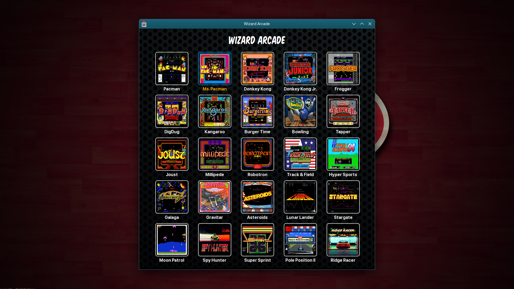

### Wizard Arcade
##### MAME Arcade Launcher
UI  Launcher for your MAME ROMS, create launcher w/

``` qml6 --quiet --qwindowicon $HOME/Arcade/joystick.png $HOME/Arcade/Main.qml ```

##### Change these vars for your setup, edit Main.qml
* gameBin -- path to mame binary
* romPath -- path to your mame roms
* gameIconsPath -- path to your game icons
* The order matters on these, each array must sync/align with title,rom,icons
    * gameTitles
    * gameRoms
    * gameIcons

#### Notes
* I made a qml app!
* KDE Linux Distro required
* ESC will quit app
* MAME required
* Game artwork/icons required
* Game ROMS/BIOS required
* Wizard Arcade was a real game room from my youth!


